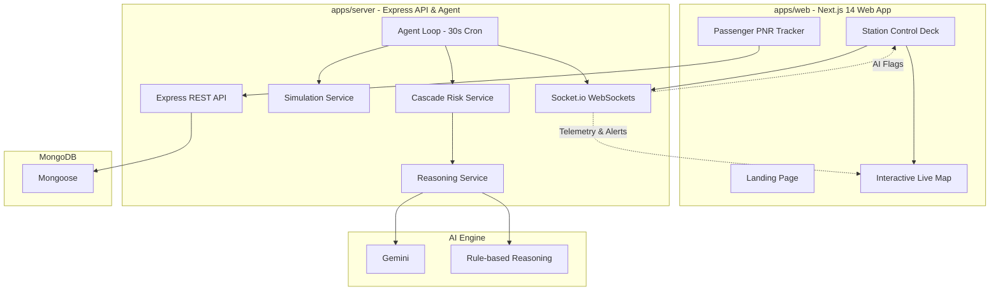

# 🚂 RailSense: AI-Powered Indian Railways Tracking & Operations Platform

RailSense is a real-time operations dashboard, AI-powered diagnostic console, and passenger tracking platform for Indian Railways. Implemented as a monorepo workspace, it leverages high-frequency simulation telemetry, WebSocket streams, and localized LLM reasoning to identify station conflicts, predict schedule cascade risks, and recommend dispatch adjustments.

---

## 🏗️ Architecture Overview

RailSense is structured as an npm workspaces monorepo containing a Next.js web client (`apps/web`) and an Express/TypeScript server backend (`apps/server`) powered by SQLite and Prisma ORM.

---

## ⚡ Key Technical Features

### 1. High-Frequency Telemetry & Live Map
* **Coordinate Interpolation (LERP)**: The simulation engine calculates train coordinates in real-time by interpolating the distance between station schedules using linear interpolation (LERP).
* **Geospatial Math**: Uses the **Haversine formula** to measure real-time distance between coordinates, estimating instantaneous speed based on segment lengths and randomized mock operational variation.
* **React-Leaflet Integration**: An interactive geospatial visualizer displaying trains dynamically traversing real Indian Railways route lines.

### 2. Autonomous Operations Agent & Conflict Detection
* **30-Second Loop**: A server-side scheduler (`node-cron`) updates coordinates, updates delays, and processes conflicts.
* **Cascade Risk Analysis**: Evaluates downstream impacts of delays by monitoring upcoming stations. If a delayed train's estimated time of arrival (ETA) overlaps with another train on the same platform within a 20-minute window, the system flags a **Platform Conflict** or **Cascade Risk**.

### 3. AI-Powered Decision Support
* Gemini Integration : Calls gemini 2.5-flash model to generate plain-English explanations (Reasoning) and actionable dispatch adjustments (Suggestions) for the station master.
* **Resilient Fallback**: Automatically falls back to a deterministic rule-based expert system if the Ollama endpoint is offline or times out.

### 4. Passenger Services
* **10-Digit PNR Status**: A passenger portal for live itinerary lookups. Validates PNR numbers, maps them to database records, and shows the passenger's current train run, speed, delay status, and active operations alerts.

---

## 🗄️ Database Schema & Models

RailSense operates on an MongoDB database :

| Model | Description |
| :--- | :--- |
| **User** | System accounts supporting both passenger credentials and operations supervisor roles. |
| **Station** | Physical stations populated with real latitude/longitude coordinates (e.g., NDLS, BCT, HWH). |
| **Platform** | Individual tracks assigned to stations for train routing. |
| **Train** | Static metadata mapping train number, name, type (e.g., Rajdhani, Shatabdi), and coach counts. |
| **Route / RouteStop** | Sequence of stations, platform assignments, arrival/departure schedules, and cumulative travel times. |
| **TrainRun** | Date-specific active instances of a train. Updates live geolocations, speed, delay minutes, and status (`ON_TIME`, `DELAYED`, `SEVERELY_DELAYED`). |
| **AgentFlag** | Operational alerts generated by the backend AI. Stores the reason for disruption, proposed suggestion, severity (`MEDIUM`, `HIGH`, `CRITICAL`), and resolution state. |
| **PNR** | Passenger Name Records detailing ticket information, assigned coach, seat number, and passenger details. |
| **Notification** | Real-time messages delivered to passengers regarding delay changes or platform reassignments. |

---
