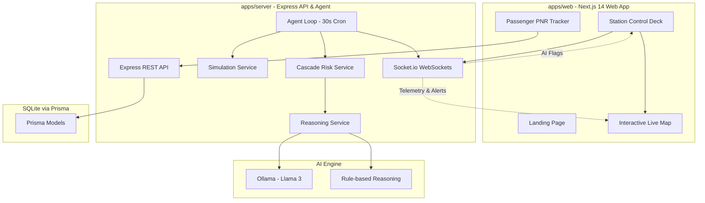

# 🚂 RailSense: AI-Powered Indian Railways Tracking & Operations Platform

RailSense is a real-time operations dashboard, AI-powered diagnostic console, and passenger tracking platform for Indian Railways. Implemented as a monorepo workspace, it leverages high-frequency simulation telemetry, WebSocket streams, and localized LLM reasoning to identify station conflicts, predict schedule cascade risks, and recommend dispatch adjustments.

---

## 🏗️ Architecture Overview

RailSense is structured as an npm workspaces monorepo containing a Next.js web client (`apps/web`) and an Express/TypeScript server backend (`apps/server`) powered by SQLite and Prisma ORM.



---

## ⚡ Key Technical Features

### 1. High-Frequency Telemetry & Live Map
* **Coordinate Interpolation (LERP)**: The simulation engine calculates train coordinates in real-time by interpolating the distance between station schedules using linear interpolation (LERP).
* **Geospatial Math**: Uses the **Haversine formula** to measure real-time distance between coordinates, estimating instantaneous speed based on segment lengths and randomized mock operational variation.
* **React-Leaflet Integration**: An interactive geospatial visualizer displaying trains dynamically traversing real Indian Railways route lines.

### 2. Autonomous Operations Agent & Conflict Detection
* **30-Second Loop**: A server-side scheduler (`node-cron`) updates coordinates, updates delays, and processes conflicts.
* **Cascade Risk Analysis**: Evaluates downstream impacts of delays by monitoring upcoming stations. If a delayed train's estimated time of arrival (ETA) overlaps with another train on the same platform within a 20-minute window, the system flags a **Platform Conflict** or **Cascade Risk**.

### 3. AI-Powered Decision Support
* **Ollama (Llama 3) Integration**: Calls a locally running Llama 3 model to generate plain-English explanations (Reasoning) and actionable dispatch adjustments (Suggestions) for the station master.
* **Resilient Fallback**: Automatically falls back to a deterministic rule-based expert system if the Ollama endpoint is offline or times out.

### 4. Passenger Services
* **10-Digit PNR Status**: A passenger portal for live itinerary lookups. Validates PNR numbers, maps them to database records, and shows the passenger's current train run, speed, delay status, and active operations alerts.

---

## 📁 Repository Structure

```
Railsence/
├── apps/
│   ├── server/                   # Express & TypeScript Backend
│   │   ├── prisma/               # SQLite database & Prisma Schema
│   │   └── src/
│   │       ├── index.ts          # Server initialization & entrypoint
│   │       ├── jobs/             # Periodic cron tasks (30s agent loop)
│   │       ├── middleware/       # JWT auth & error-handling middleware
│   │       ├── routes/           # REST endpoints (auth, trains, flags, etc.)
│   │       └── services/         # Simulation, Cascade, Reasoning & Socket logic
│   └── web/                      # Next.js 14 Frontend Web Client
│       ├── app/                  # Next.js pages & routing structure
│       ├── components/           # UI, interactive maps & dashboard controls
│       └── lib/                  # Axios APIs, Socket clients & type definitions
├── package.json                  # Root monorepo workspace configurations
└── README.md                     # Project documentation
```

---

## 🗄️ Database Schema & Models

RailSense operates on an SQLite database configured through Prisma (`apps/server/prisma/schema.prisma`):

| Model | Description |
| :--- | :--- |
| **User** | System accounts supporting both passenger credentials and operations supervisor roles. |
| **Station** | Physical stations populated with real latitude/longitude coordinates (e.g., NDLS, BCT, HWH). |
| **Platform** | Individual tracks assigned to stations for train routing. |
| **Train** | Static metadata mapping train number, name, type (e.g., Rajdhani, Shatabdi), and coach counts. |
| **Route / RouteStop** | Sequence of stations, platform assignments, arrival/departure schedules, and cumulative travel times. |
| **TrainRun** | Date-specific active instances of a train. Updates live geolocations, speed, delay minutes, and status (`ON_TIME`, `DELAYED`, `SEVERELY_DELAYED`). |
| **AgentFlag** | Operational alerts generated by the backend AI. Stores the reason for disruption, proposed suggestion, severity (`MEDIUM`, `HIGH`, `CRITICAL`), and resolution state. |
| **PNR** | Passenger Name Records detailing ticket information, assigned coach, seat number, and passenger details. |
| **Notification** | Real-time messages delivered to passengers regarding delay changes or platform reassignments. |

---

## 🚀 Getting Started

### 📋 Prerequisites
* **Node.js** (v18 or higher recommended)
* **npm** (v9 or higher)
* *(Optional)* [Ollama](https://ollama.com/) running locally with the `llama3` model pulled (`ollama pull llama3`) to enable AI recommendations.

### 🔧 Setup & Installation

1. **Clone the Repository** and navigate to the root directory:
   ```bash
   cd Railsence
   ```

2. **Install Dependencies** for the entire monorepo:
   ```bash
   npm install
   ```

3. **Configure Environment Variables**:
   Create a `.env` file in `apps/server/` or customize the existing one. Default values:

4. **Initialize and Seed the Database**:
   Run the setup script which applies migrations, generates the Prisma Client, and seeds mock railway stations, trains, routes, and user accounts:
   ```bash
   npm run setup
   ```

5. **Start the Development Servers**:
   Launch both the Next.js frontend and Express backend concurrently:
   ```bash
   npm run dev
   ```

   The services will be available at:
   * **Frontend Client**: `http://localhost:3000`
   * **API Backend**: `http://localhost:3001`
   * **WebSockets Server**: `ws://localhost:3001`

---

## 🛠️ CLI Script Reference

Run these commands from the root directory:

* `npm run dev` - Runs the backend API and Next.js frontend concurrently with color-coded console logs.
* `npm run setup` - Generates Prisma client, applies database migrations, and seeds the SQLite DB.
* `npm run seed` - Re-seeds the SQLite database with mock data.
* `npm run dev:server` - Launches only the Express server backend in watch mode.
* `npm run dev:web` - Starts only the Next.js frontend in development mode.
* `npm run build` - Builds the Next.js production bundle.
